# 🏛️ Architecture — DroneSwarm-SAR

> Documentation technique détaillée de l'architecture logicielle du système multi-agents.

---

## 📋 Table des matières

- [1. Principes directeurs](#1-principes-directeurs)
- [2. Vue en couches](#2-vue-en-couches)
- [3. Couche Domaine](#3-couche-domaine)
- [4. Couche Agents (JADE)](#4-couche-agents-jade)
- [5. Protocole de communication](#5-protocole-de-communication)
- [6. Flux d'exécution](#6-flux-dexécution)
- [7. Concurrence & thread-safety](#7-concurrence--thread-safety)
- [8. Décisions de conception](#8-décisions-de-conception)
- [9. Évolution & extension](#9-évolution--extension)

---

## 1. Principes directeurs

L'architecture repose sur **quatre principes** non négociables :

| Principe | Application concrète |
|---|---|
| **Séparation des préoccupations** | Domaine ≠ Infrastructure ≠ UI |
| **Inversion de dépendance** | Les agents dépendent du domaine, jamais l'inverse |
| **Source unique de vérité** | Un état = un seul endroit qui le détient |
| **Testabilité** | Le domaine se teste sans JADE ni Swing |

### Règle d'or

> Le package `domain/` ne contient **jamais** d'import `jade.*` ni `javax.swing.*`.

Cette contrainte garantit que la logique métier (ACO, phéromones, victimes) est **réutilisable** et **testable unitairement**, indépendamment du framework d'agents.

---

## 2. Vue en couches

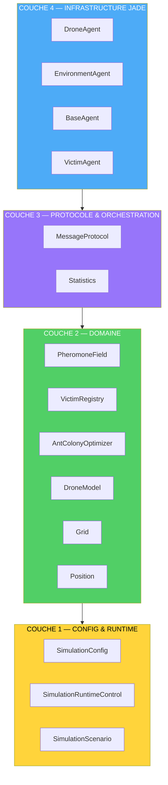

### Responsabilités par couche

| Couche | Responsabilité | Dépendances autorisées |
|---|---|---|
| **4 — Agents** | Cycle de vie JADE, behaviours, messagerie ACL | Couches 1-3, JADE |
| **3 — Protocole** | Constantes de communication, façade métriques | Couches 1-2 |
| **2 — Domaine** | Logique métier pure (ACO, phéromones, victimes, états) | Couche 1 uniquement |
| **1 — Config** | Paramétrage, contrôle runtime | Aucune |

---

## 3. Couche Domaine

### 3.1 `PheromoneField`

**Responsabilité :** stocker, évaporer et renforcer les phéromones.

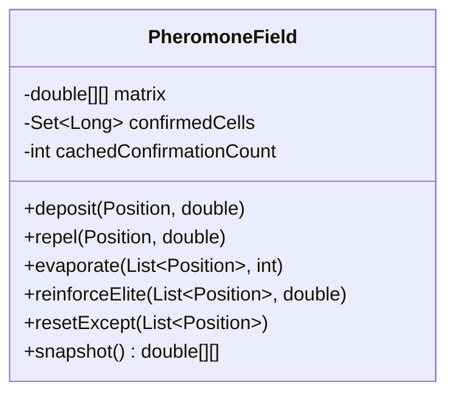

**Points clés :**

- **Évaporation différenciée** : les cellules d'un chemin confirmé s'évaporent à `ρ × 0.25`, le reste à `ρ × 2.0`.
- **Cache** : le set des cellules confirmées est reconstruit uniquement quand le nombre de confirmations change (optimisation).
- **Bornes** : phéromones positives plafonnées à `100`, négatives plancher à `-20`.

### 3.2 `VictimRegistry`

**Responsabilité :** **source unique de vérité** pour les victimes.

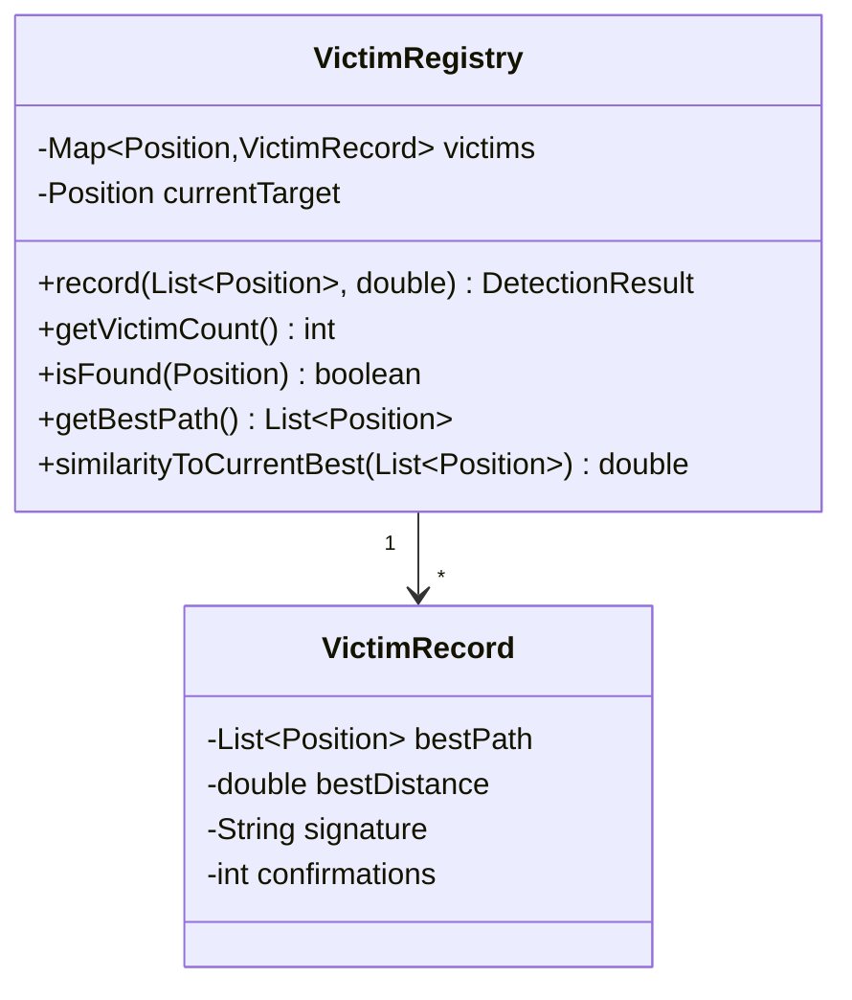

**Pourquoi une source unique ?**

Avant le refactoring, le nombre de victimes était stocké à **3 endroits** (`Grid`, `Statistics`, `SimulationFrame`), ce qui causait des désynchronisations (ex. l'UI affichait `1/5` alors que 3 victimes étaient trouvées).

**Désormais :** `VictimRegistry` détient l'état, et `Grid`, `Statistics` et l'UI **délèguent**.

### 3.3 `AntColonyOptimizer`

**Responsabilité :** sélection probabiliste du prochain pas (cœur ACO).

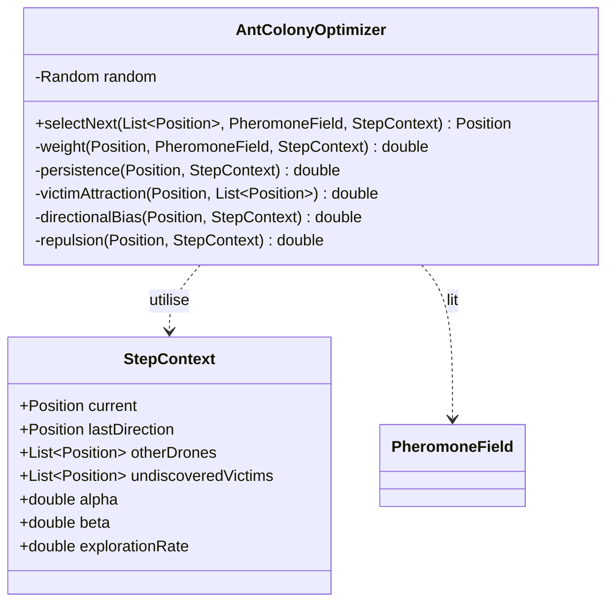

**Découplage :** `StepContext` est un **DTO immuable** qui transporte tout le contexte de décision. L'optimiseur ne connaît ni JADE, ni `Grid`, ni `DroneAgent` — il reçoit juste des données et retourne un choix.

### 3.4 `DroneModel`

**Responsabilité :** machine à états + gestion de l'autonomie.

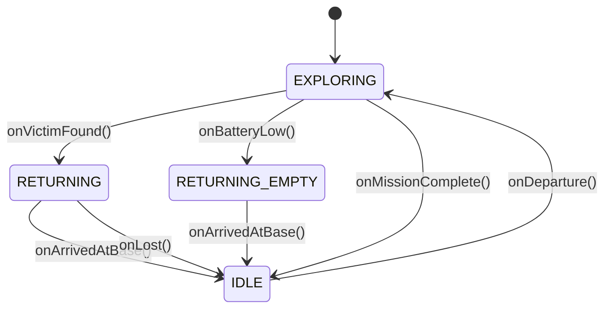

**Transitions explicites** via des méthodes nommées (`onVictimFound`, `onBatteryLow`…) plutôt que des affectations directes → logique centralisée et testable.

### 3.5 `Grid`

**Responsabilité :** topologie (dimensions, obstacles, voisinage) et positions des drones.

**Délégation :**
- Phéromones → `PheromoneField`
- Victimes → `VictimRegistry`

`Grid` conserve une API de compatibilité (`addPheromone`, `getVictimsFound`…) qui **délègue** aux composants du domaine.

---

## 4. Couche Agents (JADE)

### 4.1 Rôles

| Agent | Service DF | Behaviour principal | Responsabilité |
|---|---|---|---|
| `EnvironmentAgent` | `EnvironmentService` | `EvaporationBehaviour`, `RecruitmentListener` | Orchestration, validation, stagnation |
| `DroneAgent` | `DroneService` | `DroneMoveBehaviour`, `EnvironmentFeedbackListener` | Exploration, détection |
| `BaseAgent` | `BaseService` | `HandleReturningDrones` | Logistique |
| `VictimAgent` | `VictimService` | `HandleDetection` | Confirmation |

### 4.2 Cycle de vie d'un agent

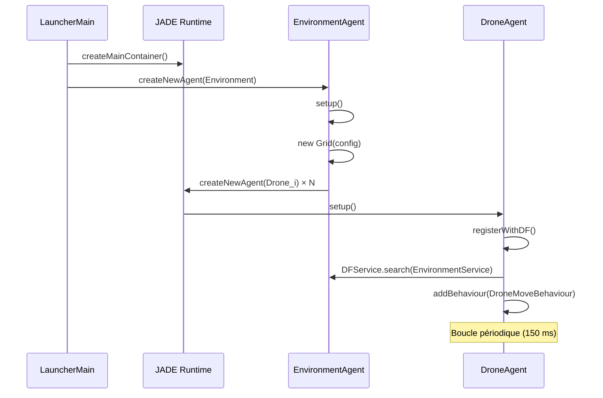

### 4.3 Délégation agents → domaine

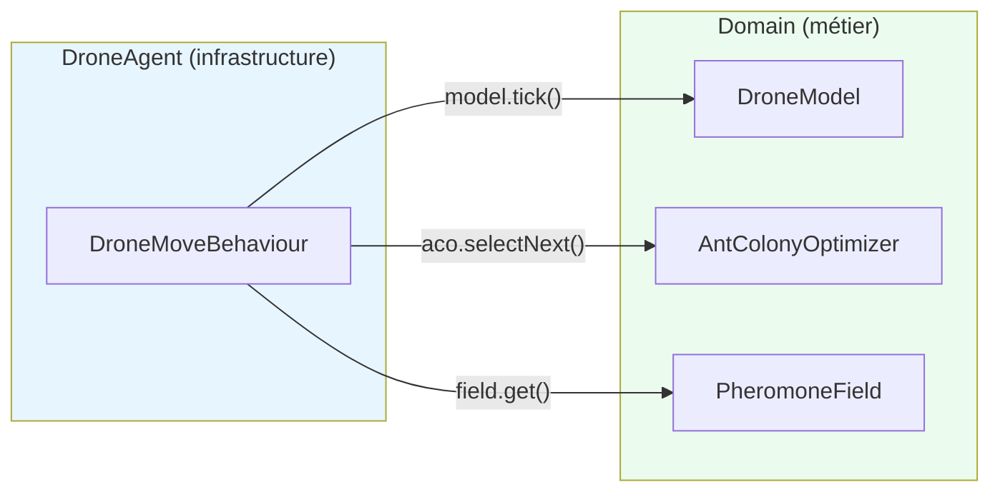

**Principe :** l'agent **orchestre** (quand appeler quoi), le domaine **décide** (comment).

---

## 5. Protocole de communication

### 5.1 Diagramme de séquence complet

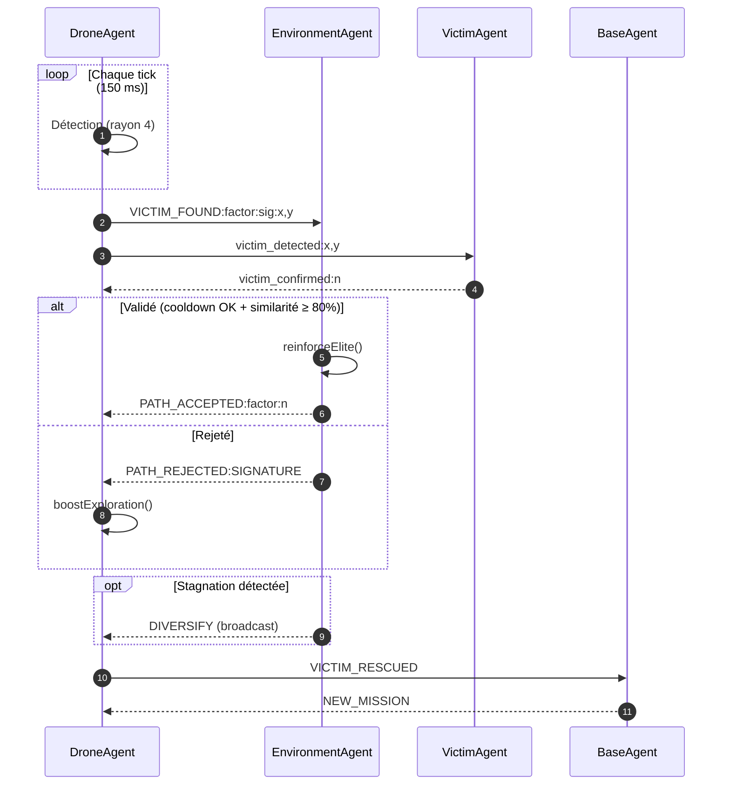

### 5.2 Table des messages

| Constante | Émetteur → Récepteur | Format | Rôle |
|---|---|---|---|
| `VICTIM_FOUND` | Drone → Environment | `VICTIM_FOUND:factor:sig:x,y` | Proposer une détection |
| `PATH_ACCEPTED` | Environment → Drone | `PATH_ACCEPTED:factor:n` | Chemin validé |
| `PATH_REJECTED` | Environment → Drone | `PATH_REJECTED:raison` | Chemin rejeté |
| `DIVERSIFY` | Environment → Tous | `DIVERSIFY` | Ordre de diversification |
| `VICTIM_DETECTED` | Drone → Victim | `victim_detected:x,y` | Notification victime |
| `VICTIM_CONFIRMED` | Victim → Drone | `victim_confirmed:n` | Accusé de réception |
| `VICTIM_RESCUED` | Drone → Base | `VICTIM_RESCUED` | Victime ramenée |
| `NEW_MISSION` | Base → Drone | `new_mission` | Nouvelle mission |

### 5.3 Ontologies

| Ontologie | Usage |
|---|---|
| `DRONE_RETURNED` | Notification de retour à la base |
| `NEW_MISSION` | Attribution d'une nouvelle mission |
| `VICTIM_DETECTED` | Détection d'une victime |
| `VICTIM_CONFIRMED` | Confirmation d'une victime |

---

## 6. Flux d'exécution

### 6.1 Démarrage

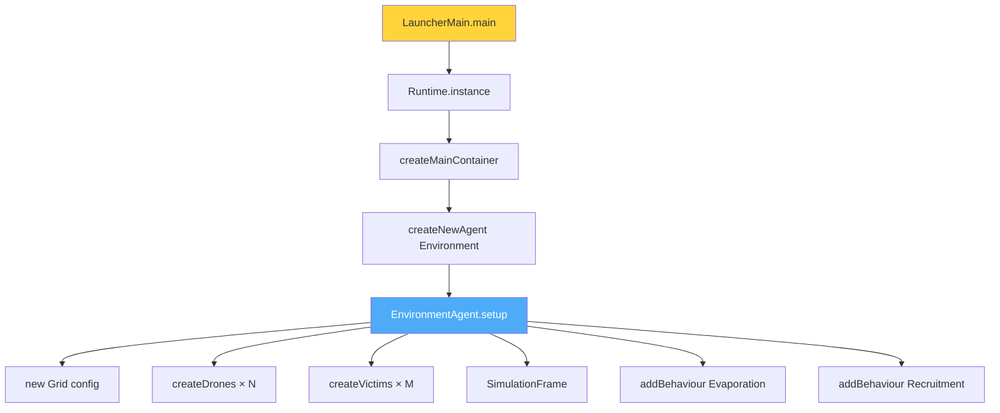

### 6.2 Boucle principale

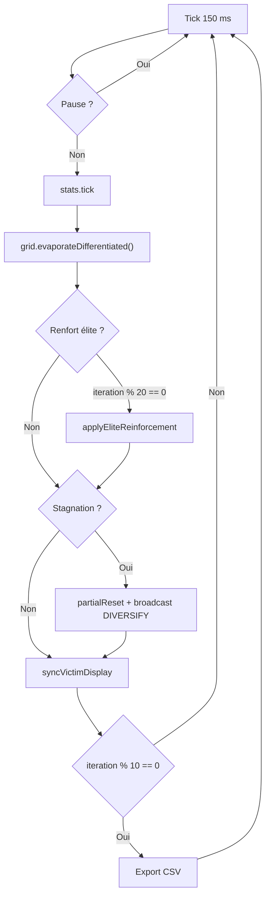

---

## 7. Concurrence & thread-safety

### 7.1 Modèle de concurrence

| Composant | Thread | Synchronisation |
|---|---|---|
| `DroneAgent` | 1 thread JADE par drone | Aucun état partagé mutable |
| `EnvironmentAgent` | 1 thread JADE | `synchronized` sur le domaine |
| `PheromoneField` | Partagé | `synchronized` sur toutes les mutations |
| `VictimRegistry` | Partagé | `synchronized` sur toutes les mutations |
| `Grid.dronePositions` | Partagé | `ConcurrentHashMap` |
| `SimulationRuntimeControl` | Partagé | `AtomicInteger` / `AtomicBoolean` |

### 7.2 Stratégie

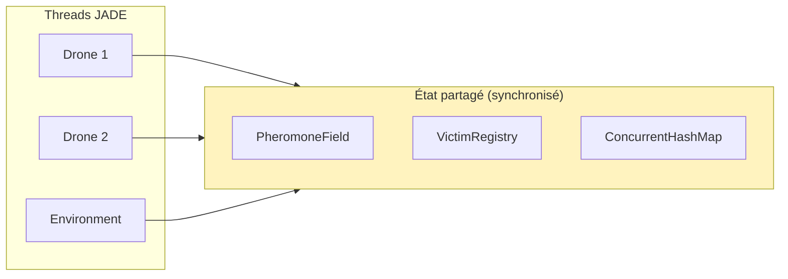

**Règle :** toute mutation d'état partagé passe par une méthode `synchronized` du domaine. Les lectures exposent des **snapshots défensifs** (copies).

---

## 8. Décisions de conception

### 8.1 Pourquoi `domain/` séparé de `agents/` ?

| Avant | Après |
|---|---|
| ACO mélangé à `DroneAgent` (600 lignes) | `AntColonyOptimizer` isolé (~220 lignes) |
| Impossible de tester sans JADE | Testable avec un simple `new` |
| 4 responsabilités par classe | 1 responsabilité par classe |

### 8.2 Pourquoi `VictimRegistry` centralisé ?

Trois compteurs désynchronisés causaient des bugs d'affichage. Une source unique élimine la classe entière de bugs.

### 8.3 Pourquoi `StepContext` (DTO) ?

Passer 16 paramètres à `selectNext()` serait illisible. Un DTO immuable rend la signature claire et le test facile.

### 8.4 Pourquoi `MessageProtocol` ?

Les chaînes magiques (`"PATH_ACCEPTED"`) dispersées sont une source de fautes de frappe silencieuses. Centraliser → une seule référence.

### 8.5 Pourquoi la détection AVANT et APRÈS le déplacement ?

Un drone qui se déplace de 1 case peut traverser une zone de perception. Tester les deux positions garantit qu'aucune victime n'est ratée.

---

## 9. Évolution & extension

### 9.1 Ajouter un nouveau comportement de drone

1. Créer la logique dans `domain/` (POJO testable)
2. Ajouter un `Behaviour` dans `DroneAgent` qui **délègue** au domaine
3. Si nouveau message → ajouter la constante dans `MessageProtocol`

### 9.2 Ajouter un nouveau type d'agent

1. Créer la classe dans `agents/`
2. Enregistrer un service DF (`MessageProtocol.SERVICE_*`)
3. Ajouter les constantes de communication

### 9.3 Points d'extension prévus

| Extension | Où intervenir |
|---|---|
| Nouvelle heuristique ACO | `AntColonyOptimizer.weight()` |
| Nouveau type de phéromone | `PheromoneField` |
| Nouveau scénario | `SimulationScenario` |
| Nouvelle métrique | `MetricsExporter` + `Statistics` |
| Nouvel état de drone | `DroneModel.State` |

### 9.4 Dette technique restante

| Point | Priorité | Note |
|---|---|---|
| Tests JUnit sur `domain/` | Haute | La couche est prête, tests à écrire |
| `serialVersionUID` sur classes JADE | Basse | Warnings uniquement |
| Optimisation évaporation (sparse) | Basse | 60×60 = 3600 cellules, acceptable |

---

**DroneSwarm-SAR** — Architecture en couches pour un SMA robuste et testable.

